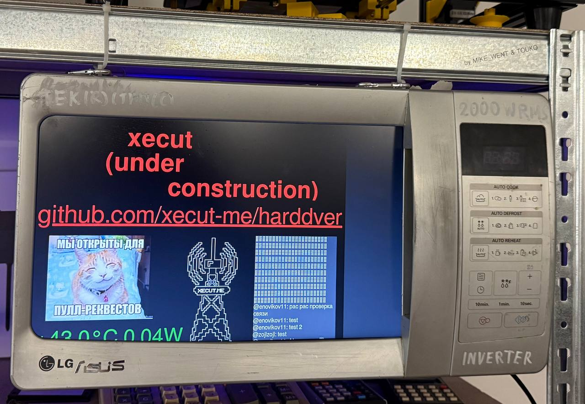
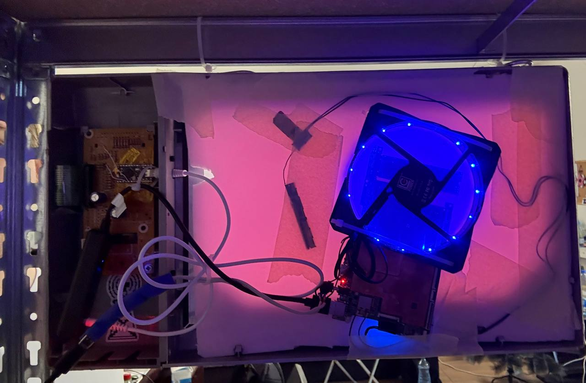

# HardWave - микроволновка-экран

</img><br/>

Арт-объект хакспейса [Xecut](https://xecut.me) — экран в корпусе микроволновки, отображающий медиа из Telegram-чата в реальном времени.

Отображает фото, видео и GIF, присланные в [xexecut_chat](https://t.me/xexecut_chat). Кнопки на панели микроволновки работают как USB-клавиатура, а 4-разрядный дисплей показывает текст.

## История

Этот девайс раньше был ноутбуком, но у него умерла клавиатура после чистки. Тогда он стал **харддверью** (harddver — от слов hardware и дверь) и висел на двери в спейс.

Потом у харддвери умер аккумулятор — она стала вырубаться от щелчка замком и переехала на стеллаж. Затем умерла подсветка экрана — тот был заменён. Теперь снова в строю во фрейме от микроволновки.

**Харддверь — самый часто перерождавшийся в хакспейсе артефакт.**

## Архитектура

Работает максимально просто: **Alpine Linux в RAM + Chromium в режиме киоска + статическая HTML-страница**.

Никакого бэкенда — браузер напрямую long-poll'ит Telegram Bot API и отображает медиа. SSD на устройстве барахлит, поэтому система работает в эфемерном режиме (всё в RAM, диск почти не трогается).

```
hardwave/
├── www/               # Веб-страница (основной код)
├── keyboard/          # Прошивка микроконтроллера (CircuitPython)
├── linux/             # Системные конфиги Alpine Linux
├── harddver/          # [АРХИВ] Старая версия на Python/Selenium
└── docs/              # Фото проекта
```

## www/ — Веб-страница

Standalone HTML, который напрямую работает с Telegram Bot API.

**Параметры URL:**
- `api_key` — токен Telegram-бота (обязательно)
- `chat_id` — ID чата для фильтрации (обязательно)
- `respect_aspect_ratio=1` — сохранять пропорции изображений

Подробнее: [www/readme.md](./www/readme.md)

## keyboard/ — USB-клавиатура

Прошивка на CircuitPython для микроконтроллера, превращающая панель управления микроволновки в USB HID-устройство.

**Маппинг кнопок:**

| Кнопка | Клавиша |
|--------|---------|
| COOK | `C` |
| DEFROST | `D` |
| REHEAT | `R` |
| START | `Enter` |
| STOP | `Esc` |
| PLUS/MINUS | Numpad `+`/`-` |

4-разрядный дисплей принимает текст по кастомному HID-интерфейсу.

Подробнее: [keyboard/README.md](./keyboard/README.md)

## linux/ — Системные конфиги

Конфигурация Alpine Linux для режима киоска:
- Эфемерный режим (работа в RAM)
- Автологин пользователя `kiosk`
- Автозапуск X11 + Chromium

## Железо

| | |
|---|---|
| Компьютер | Бывший 16.5" ноутбук (материнка + экран) |
| ОС | Alpine Linux (эфемерный режим) |
| Микроконтроллер | nRF52840-based (CircuitPython) |
| Корпус | Панель от микроволновки |

**Энергопотребление:** idle 8.5-9W, под нагрузкой 15-18W

## Ссылки

- Telegram-чат: https://t.me/xecut_chat
- Хакспейс Xecut: https://xecut.me
- Локация: [Google Maps](https://maps.app.goo.gl/3HHK6u5sVnd8456M7)

## Фото

</img><br/>
</img><br/>

## Архив: harddver/

Старая версия системы на Python + Selenium. **Не используется** — оставлена для истории.

Включала Telegram-бота с командами `/display`, `/screenshot`, `/deploy` и управление Chromium через Selenium. Сейчас всё это не нужно, т.к. браузер сам справляется.

Подробнее: [harddver/README.md](./harddver/README.md)
