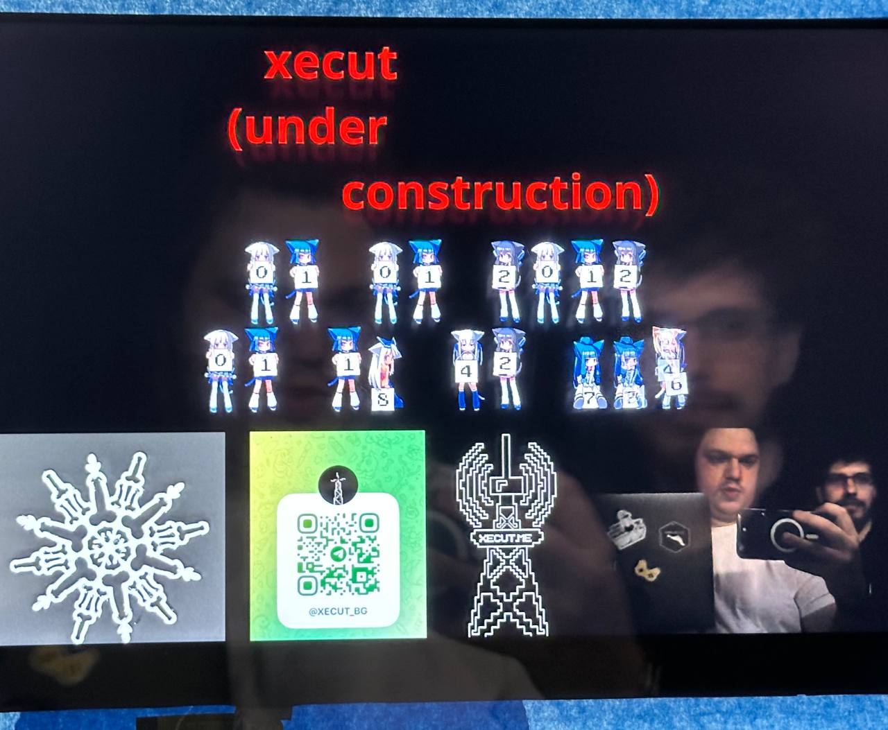
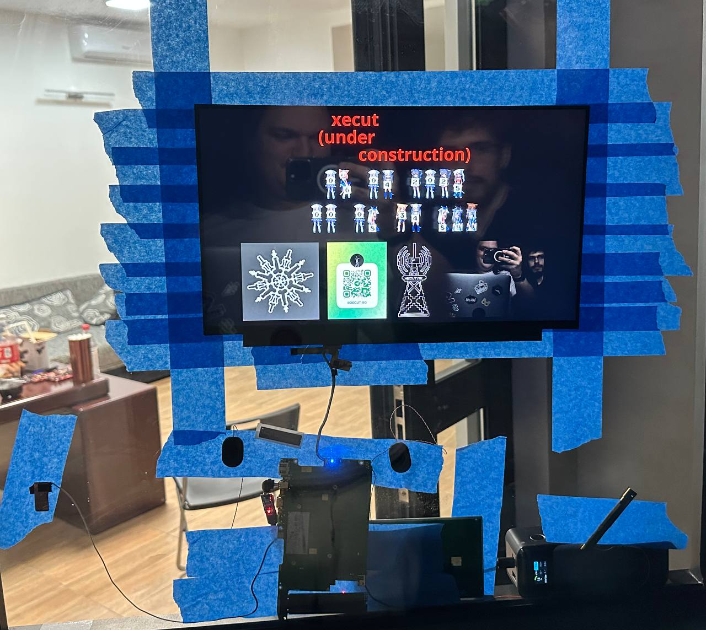
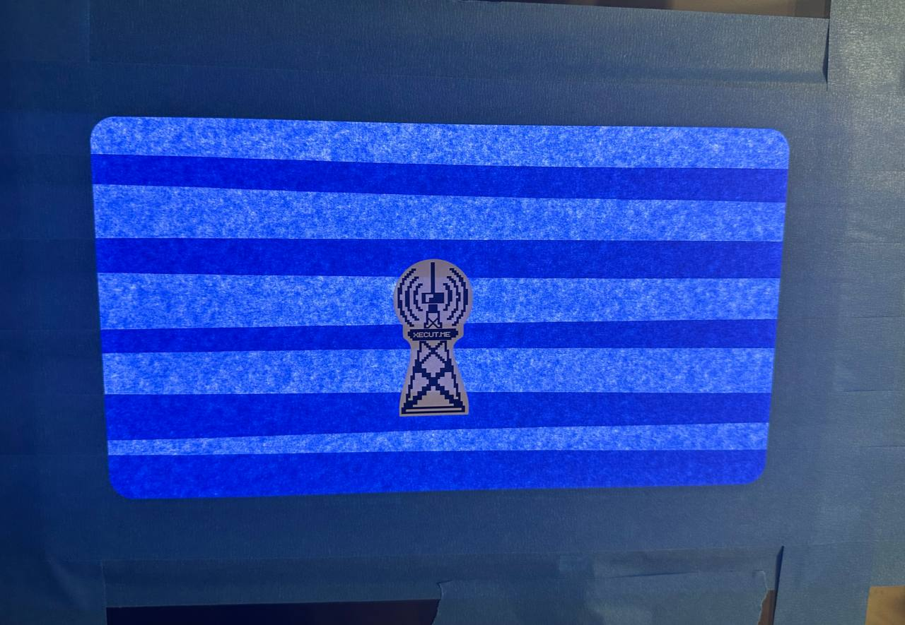
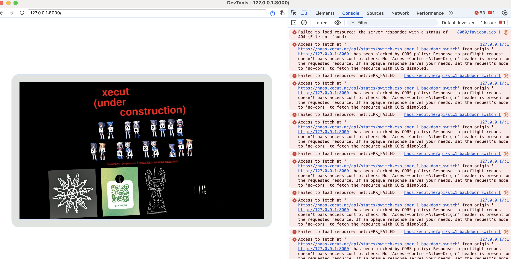

# Хард Дверь = hardware дверь

Это страница двери в хакспейс Xecut, присылайте пулл реквесты ;)  

Дверь это бывший 16.5" ноут, разобранный и приклеенный 3M липкой лентой к двери  

Чтобы задеплоить пинганите https://t.me/enovikov11 или вступвйте в чат с админкой https://t.me/+IBkZEqKkqRlhNGQy  

</img><br/>
</img><br/>
</img><br/>

# Архитектура

Телеграм ботик, он же http сервер, он же chromium с selenium для управления это main.py.  

Статический сайт расположен в ./static  

# Идеи

## Сохранение видеофида (приватно, для целей физбеза)

- Записывать через ws, дробить в папках по дате (чтобы было меньше 10к файлов)
- Сжимать чтобы не жрало все место слишком быстро
- Ротировать файлы раз в 10 минут
- Бекапить на удаленный сервер
- Шифровать с открытым ключем
- Delete protection по событиям (priority)

## Обработка событий двери

- Обрабатывать LOCK_STATUS (открыт = можно открыть дверь кодом, закрыт = закрыто на ключ)
- Обрабатывать DOOR_OPENED (статус датчика на двери, надо по вебсокету подписываться https://developers.home-assistant.io/docs/api/websocket/)

## Прочее

- Виджеты: каждая картинка это виджет
- Софтверный вотчдог
- Баланс белого в картинке
- Виджет который отображает последнюю пришедшую картинку на весь экран на 10 сек
- Визуальный drag and drop конструктор, resizable, config

## Хардверное

- Запускать все включая иксы в докере
- Переустановить alpine в эфемерный режим
- Приклеить радиатор или залить маслом
- Повесить ногу еспшки на кнопку включения
- Тачскрин
- Приклеить ИК камеру (у нее плохой фокус вдаль)

# Админские команды @harddver_bot

display - Добавить сообщение
screenshot - Сделать скриншот
deploy - [ADMIN] Передеплоить бота
url - [ADMIN] Установить кастомный URL, например http://192.168.1.x:8080/
reload - [ADMIN] Обновить страницу
getdata - [ADMIN] Увидеть инжектимые данные

# Добавление секретов

```bash
ssh kiosk
su kiosk
vim ~/harddver/secret.py
```

# Как налить все с нуля

1. Установить https://alpinelinux.org  

2. Выполнить команды  

```bash
apk add --no-cache xorg-server xf86-video-intel xf86-input-evdev xinit chromium openbox chromium \
    chromium-chromedriver udev ttf-freefont dbus bash curl ca-certificates xdg-utils arp-scan libcap

setcap cap_net_raw+ep /usr/bin/arp-scan

pip install -r requirements.txt --break-system-packages
```

3. Настроить иксы, профиль и openrc файлы, см папку linux

# Дебаг хрома

</img>

```bash
ssh -L 9222:localhost:9222 kiosk
```

chrome://inspect/#devices

# Управление openrc сервисом

```bash
rc-service kiosk stop
rc-service kiosk start
rc-update del kiosk
rc-update add kiosk default
```

# VNC

Хз из-за чего, но работает плохо, юзайте /screenshot

http://localhost:6080/vnc.html?autoconnect=1&resize=scale&password=123123

```bash
ssh -L 6080:localhost:6080 kiosk

x0vncserver -display :0 -localhost -PasswordFile ~/.vnc/passwd

~/noVNC/utils/novnc_proxy --vnc localhost:5900 --listen localhost:6080

apk add tigervnc
```

# Power usage

poweroff 0.3W  
idle 8.5-9W  
under full load 15-18W  

# Как тестить ботика без гитхаба

```bash
scp ~/Desktop/xecut/harddver/main.py kiosk@kiosk:/home/kiosk/harddver/main.py

DISPLAY=:0 /usr/bin/chromium --kiosk --no-first-run --disable-infobars --noerrdialogs --use-fake-ui-for-media-stream  http://192.168.1.58:8000/

DISPLAY=:0 /usr/bin/chromium --kiosk --no-first-run --disable-infobars --noerrdialogs --use-fake-ui-for-media-stream file:///root/kiosk-website/index.html
```

# Запись

```js
let recordedChunks = [];

recorder = new MediaRecorder(stream);
recorder.ondataavailable = (e) => { if (e.data.size > 0) recordedChunks.push(e.data); };

recorder.onstop = () => {
    const blob = new Blob(recordedChunks, { type: "video/webm" });
    const url = URL.createObjectURL(blob);
    const filename = (new Date()).toISOString().replace(/[:T]/g, "-").split(".")[0] + ".webm";

    URL.revokeObjectURL(url);
};

setInterval(() => { recorder.stop(); recorder.start(); }, 10000);
recorder.start();
```
